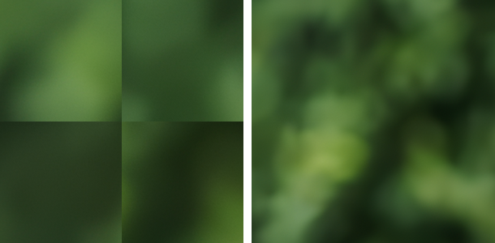

# Upflow para agentes (Claude Code, Codex, cualquier cliente MCP)

Todo lo que un agente necesita para reescalar o restaurar una foto **sin abrir la UI y sin
levantar el servidor**: una CLI headless, un servidor MCP que sabe correr en
proceso, y una API con `/health` y parámetros de tiling explícitos.

## Instalación mínima

```powershell
git clone https://github.com/santiquiroz/upflow
cd upflow
python -m venv .venv
.venv\Scripts\pip install -e .
.venv\Scripts\pip install -e .[dev]     # solo para correr los tests
scripts\download-realesrgan.ps1        # pack ncnn (binario + modelos builtin) -> vendor/realesrgan
```

`pip install -e .` deja dos scripts en `.venv\Scripts\`: `upflow` (CLI) y
`upflow-mcp` (servidor MCP). Con el venv activado se llaman por nombre; sin
activarlo, por ruta (`.venv\Scripts\upflow.exe`).

## Tres comandos copiables

```powershell
# 1. ¿Hay GPU, pack ncnn y qué modelos puedo pedir?
upflow health --json

# 2. Reescalar 2x sin tocar la UI (el modelo corre a 4x y Upflow reduce con Lanczos)
upflow upscale --in foto.png --out foto-2x.webp --model realesrgan-x4plus --scale 2 --json

# 3. Modelos instalados (ids válidos para --model)
upflow models --json
```

`--json` imprime **una sola línea** al final; todo lo demás va a stderr. Sin
`--json` imprime una línea legible.

Salida de `upscale --json`:

```json
{"ok": true, "output": "C:/.../foto-2x.webp", "width": 2048, "height": 1152,
 "model": "realesrgan-x4plus", "engineModel": "realesrgan-x4plus",
 "engine": "realesrgan-ncnn-vulkan", "device": "dml:0", "scale": 2, "nativeScale": 4,
 "resized": true, "tile": {"size": 0, "overlap": 10, "meaning": "binary auto (heap-based)"},
 "format": "webp", "seconds": 6.7}
```

## Parámetros de `upflow upscale`

| Flag | Default | Qué hace |
|---|---|---|
| `--in PATH` | — | imagen de entrada (png/jpg/webp/bmp) |
| `--out PATH` | — | salida; la extensión define el formato salvo que se pase `--format` |
| `--model ID` | `realesrgan-x4plus` | builtin (`realesrgan-x4plus`, `realesrgan-x4plus-anime`, `realesr-animevideov3`) o un id de `upflow models` |
| `--scale 2\|3\|4` | `4` | escala pedida. Con un modelo x4 y `--scale 2/3` el motor corre a 4x y Upflow reduce con Lanczos (`resized: true`) |
| `--tile N` | omitido = auto | `auto`: ncnn deja al binario elegir por heap de VRAM (200 px en GPUs con >1.9 GB), ONNX usa `ONNX_TILE_SIZE`. `0`: sin tiling — ncnn elige el mayor tile que entra en la VRAM libre (tope: lado mayor de la imagen), ONNX un solo pase. `N>=32`: tile fijo |
| `--tile-overlap N` | `16` | solo motor ONNX (mezcla con feather). ncnn usa un prepadding fijo de 10 px, se reporta como `overlap: 10` |
| `--device ID` | `DEFAULT_DEVICE` | `dml:0`, `dml:1`, `cpu` (cpu solo con modelos ONNX) |
| `--format` | extensión de `--out` | `png`, `jpg`, `jpeg`, `webp` (los escribe el motor), `jxl`, `avif` (PNG del motor + ffmpeg vendorizado: `libjxl -distance 1.0`, `libaom-av1 -crf 18 -still-picture 1`) |

Otros subcomandos: `upflow models`, `upflow health`, `upflow preflight --repo <hf-repo>`,
`upflow install --repo <hf-repo> --yes` (sin `--yes` no descarga nada y sale con 2).

## Restaurar fotos (`upflow restore`)

La misma cadena que la pestaña "Restore photo" (daños, trama de impresión,
bloques JPEG, ruido, tono, caras, color), en proceso y sin servidor. Todo corre
en la PC: la foto nunca sale de ella.

```powershell
# Pasos elegidos a mano, con los ajustes del preset "gentle" como base
upflow restore --in escaneo.tif --out abuela.png --steps repair,denoise,tone --preset gentle --json

# Sin --steps: Upflow analiza la foto y corre lo que propone el preset
# (el que pasás con --preset o el que sugiere el análisis)
upflow restore --in recorte.jpg --out recorte-restaurado.png --json

# Girar, recortar y agrandar x2 con Lanczos (sin IA)
upflow restore --in foto.jpg --out foto.png --steps tone --rotate 90 --crop 10,10,800,600 --scale 2 --upscale classic
```

| Flag | Default | Qué hace |
|---|---|---|
| `--in PATH` | — | foto de entrada (png/jpg/webp/bmp/tif) |
| `--out PATH` | — | salida; la extensión define el formato salvo `--format` (`png`, `jpg`, `jpeg`, `webp`) |
| `--steps CSV` | omitido = análisis | `descreen,repair,deblock,denoise,tone,faces,colorize`. El orden lo fija Upflow, no el de la lista |
| `--preset ID` | con `--steps`: ninguno; sin `--steps`: el que propone el análisis | `gentle`, `heavy_damage`, `newspaper`, `faded_color_print`, `portrait`. Con `--steps` solo aporta los ajustes de esos pasos; sin `--steps` elige también los pasos según lo que encontró el análisis |
| `--scale N` | `1` | `1` = sin agrandar; `2`–`4` agranda la foto restaurada |
| `--upscale none\|classic\|ai` | `none` con `--scale 1`, `ai` si no | `classic` = Lanczos en CPU; `ai` usa `--model` (default `realesrgan-x4plus`, inventa textura) |
| `--face-blend 0..1` | el del preset | mezcla de las caras restauradas con las originales (paso `faces`) |
| `--rotate 0\|90\|180\|270` | `0` | giro antes de todo lo demás |
| `--crop x,y,w,h` | — | recorte en píxeles, medido después de girar |
| `--device ID` | `DEFAULT_DEVICE` | `cpu`, `dml:0`... (`auto` necesita el servidor) |

Junto a `--out` quedan `<nombre>.restore.json` (los detalles: pasos, modelos,
placa y precisión, caras, qué se inventó, hashes) y, si hubo color,
`<nombre>.uncolored.<ext>`. La vista, el antes/después y los recortes de caras
se borran al terminar, así que **recomponer caras necesita el servidor**.

Salida de `restore --json` (recortada):

```json
{"ok": true, "output": "C:/.../foto.png", "uncolored": null, "details": "C:/.../foto.restore.json",
 "width": 1600, "height": 1200, "steps": ["descreen", "tone"], "preset": "gentle",
 "options": {"tone": {"strength": 0.7, "fix_faded": true}, "upscale_mode": "classic"},
 "scale": 2, "upscale": {"mode": "classic", "scale": 2.0}, "device": "cpu", "format": "png",
 "faces": [], "compositeReasons": [], "badge": false, "warnings": [], "cpuFallback": [],
 "recomposeAvailable": false, "token": null, "seconds": 0.2}
```

`compositeReasons` no vacío (caras, color, rellenos grandes, agrandado
generativo) significa que la foto tiene detalle inventado: el JSON de
detalles lo declara y la imagen lleva la insignia (`"badge": true`); por MCP
se apaga con `options.badge = false`.

Si falta un pack de modelos para un paso, sale con `3` y el mensaje dice cuál
bajar desde la app. Mismo input + mismos parámetros ⇒ mismos bytes (id
`cli-<sha1>` como en `upscale`).

## Códigos de salida y errores

| Código | Significado | Ejemplo de `error` |
|---|---|---|
| `0` | ok | — |
| `2` | argumentos inválidos | `Scale must be one of [2, 3, 4]`, `unsupported output format 'tiff'`, `downloads need --yes`, `--crop needs four integers x,y,w,h`, `the analysis found nothing for preset 'gentle' to fix; choose steps with --steps` |
| `3` | modelo no instalado | `builtin model 'realesrgan-x4plus' needs the realesrgan-ncnn pack at ...`, `model 'x' is not installed (see upflow models)`, `Falta los modelos de restauración de fotos (...). Lo pide el paso de restauración 'denoise'.` |
| `4` | dispositivo | `Unknown device id 'dml:9'`, `device 'auto' needs the server's router; pass an explicit device` |
| `5` | fallo de inferencia u operación | `Real-ESRGAN NCNN reported a Vulkan failure (vkAllocateMemory failed -2); usually the tile does not fit in VRAM. Retry with a smaller tile_size`, `ffmpeg could not encode jxl: ...` |

Con `--json` los errores también salen como una línea: `{"ok": false, "error": "...", "code": 3}`.

## Determinismo

Mismo input + mismos parámetros ⇒ mismos bytes de salida. El binario ncnn es
determinista (tres corridas del mismo job dieron el mismo MD5), la reducción
Lanczos de Pillow también, y el id interno del job es un hash del contenido y
los parámetros (`cli-<sha1>`), así que no queda ningún nombre temporal
aleatorio en la metadata. `seconds` es el único campo que varía entre corridas.

## MCP

`upflow-mcp` expone los mismos parámetros y el mismo JSON que la CLI:

| Tool | Equivale a |
|---|---|
| `upflow_health` | `upflow health --json` (con servidor: además el `/health` del servidor) |
| `upflow_upscale_image` | `upflow upscale` — acepta `tile_size`, `tile_overlap`; usa el servidor si está, si no corre en proceso |
| `upflow_upscale_image_headless` | `upflow upscale` siempre en proceso (sin servidor) |
| `upflow_list_models` | `upflow models --json` |
| `upflow_preflight_upscaler` | `upflow preflight --repo` (en proceso; `upflow_model_preflight` es la variante por servidor, multi-kind) |
| `upflow_install_upscaler(repo_id, confirm=true)` | `upflow install --repo --yes` (en proceso, espera a que termine; `upflow_install_model` es la variante por servidor, asíncrona) |
| `upflow_restore_analyze(file_path)` | diagnóstico de la foto: `token`, `proposedPreset`, `proposedSteps`, `proposedOptions`, `presetSelections`, caras y daño. En proceso suma `previewPath` |
| `upflow_restore_photo(file_path \| token, steps, options, scale=1, device)` | `upflow restore`. `steps` es obligatorio (tomalo de `proposedSteps`); `options` tiene la forma de `proposedOptions` más `upscale_mode`, `geometry`, `badge`, `keep_gps`, `photo_date`. Con `token` usa las caras y la máscara del análisis. Con servidor devuelve el job (`restoreSteps`, `stage`) y con `destination_path` guarda el resultado; sin servidor devuelve el JSON de `restore --json` |
| `upflow_restore_recompose(job_id, faces)` | rehace la mezcla de las caras de un job terminado sin volver a correr modelos (`faces`: `{"0": {"enabled": true, "blend": 0.4}}`). Solo con servidor |

Un `token` de `upflow_restore_analyze` en proceso sirve para `upflow_restore_photo`
en proceso; su sesión queda en `runtime/video-work/restore-<token>` hasta que el
barrido del servidor la borra por edad (`upflow restore` sin `--steps` borra la
suya al terminar).

Modos (`--mode` o variable `UPFLOW_MCP_MODE`): `auto` (default: servidor si
responde en `UPFLOW_URL`, si no in-process), `server`, `inprocess`.
`upflow_job_status`/`upflow_wait_job` de un job de restauración suman
`restoreSteps` y la etapa en curso (`stage`, p. ej. `restore_denoise`).
`--autostart` levanta `uvicorn app.main:app` en el puerto de `UPFLOW_URL`
(8090 por default) si no hay nadie escuchando, espera hasta 60 s y sigue en
in-process si no arranca.

### Registrar en Claude Code

```bash
claude mcp add upflow -- upflow-mcp --autostart
# o con ruta completa, sin activar el venv:
claude mcp add upflow -- C:/ruta/a/upflow/.venv/Scripts/upflow-mcp.exe --autostart
```

### Registrar en Codex

En `~/.codex/config.toml`:

```toml
[mcp_servers.upflow]
command = "C:/ruta/a/upflow/.venv/Scripts/upflow-mcp.exe"
args = ["--autostart"]
```

## API REST (si preferís hablar con el servidor)

```bash
curl http://127.0.0.1:8090/api/v1/health
# -> version, ncnnAvailable, onnxAvailable, devices[{id, freeVramMb}], defaultDevice,
#    modelsInstalled, tile{ncnnDefault, onnxTileSize, onnxTileOverlap}

curl -X POST http://127.0.0.1:8090/api/v1/jobs -F "file=@foto.png" \
  -F "model_name=realesrgan-x4plus" -F "scale=2" -F "output_format=webp" -F "tile_size=0"
curl http://127.0.0.1:8090/api/v1/jobs/<jobId>
# -> metadata.effective: {engine, command, nativeScale, requestedScale, tileSize, tileOverlap, resized}
```

## Por qué existe el parámetro de tiling (y la reducción Lanczos)

`realesrgan-ncnn-vulkan` no sabe reescalar a una escala distinta de la del
modelo. Con `-s 2` sobre `realesrgan-x4plus` producía una imagen del tamaño
correcto pero armada con el cuarto superior izquierdo de cada tile ampliado
x4: una rejilla de bloques de 400 px con saltos de brillo (PSNR 13 dB contra
el x4 real). Desde 2026-09-02 el motor corre siempre a la escala nativa y
Upflow reduce con Lanczos; `tests/test_seams.py` mide la rejilla y falla si
vuelve.



Medido en una RX 7800 XT (16 GB) con `realesrgan-x4plus` a 4x sobre 1024×576:

| `-t` | pico de VRAM | tiempo | costuras |
|---|---|---|---|
| 0 (auto → 200) | 1.5 GB | 7.0 s | no |
| 400 | 4.1 GB | 5.8 s | no |
| 600 | 8.1 GB | 6.9 s | no |
| 900 | 11.7 GB | 6.9 s | no |
| 1000 / 1024 | — | — | `vkAllocateMemory failed -2`, imagen plana con exit 0 (ahora se detecta y falla con código 5) |

Tiles más grandes no acortan el tiempo ni cambian la calidad a escala nativa,
por eso el default sigue siendo el `auto` del binario y `tile_size=0` se
resuelve como "el mayor tile que entra en la VRAM libre" (≈ 600 MB + 0.0215 MB
por píxel de tile) en vez de "sin tiling a ciegas".
